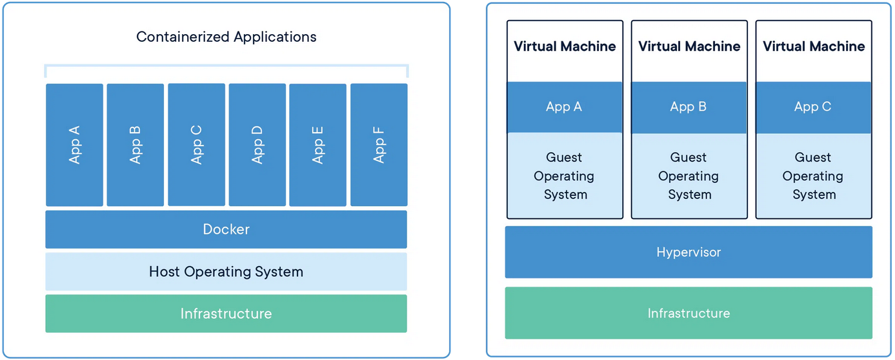
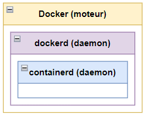
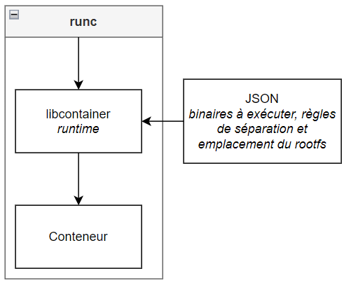
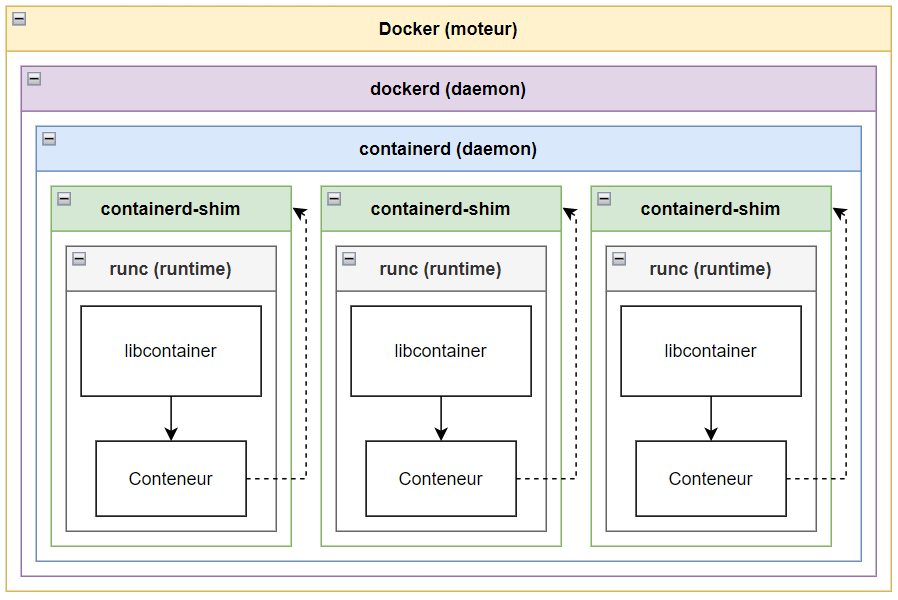

## Présentation de Docker, Inc.

dotCoud, Inc. est une société américaine fondée en 2008 par Kamel Founadi, Solomon Hykes et Sebastien Pahl. A l'origine, il s'agissait d'une PaaS (Platform as a Service) qui permettait aux développeurs de compiler et exécuter du code sur leur plateforme.

En 2013, la société se renomme Docker, Inc et lance un produit homonyme qui révolutionne l’utilisation des conteneurs. Au fil du temps, Docker développe plusieurs produits qui sont considérés aujourd’hui comme des standards de l’industrie des conteneurs:

- Leur produit phare homonyme est un moteur de conteneur qui occupe aujourd’hui la moitié du marché mondial. 
- DockerHub est une solution de stockage et de distribution de conteneurs, comme un GitHub spécialisé pour les conteneurs. Il est utilisé par des organisations mondialement connues. 
- containerd est le runtime de conteneur (l’équivalent d’un hyperviseur pour une machine virtuelle) de Docker. containerd à été donné par Docker à la Linux Foundation et est aujourd’hui le runtime standard de la CNCF (Cloud Native Computing Foundation)
- Le projet Moby est composé de librairies pour la gestion de conteneurs, un cadre de test et de déploiement de conteneurs. Il sert à la construction de systèmes plus complexes basés sur Docker et containerd. 
- Docker Scout est un analyseur de conteneurs qui aide les développeurs à corriger les vulnérabilités connues. 

Docker est l’entreprise la plus connue sur le marché des conteneurs et de leur gestion et possède aujourd’hui la plus grande part du marché, mais elle subit une concurrence de plus en plus rude de la part de AWS et Azure. 

## Fonctionnement de Docker

Nous allons à présent nous concentrer sur le produit Docker, et plus particulièrement le fonctionnement de sa gestion de conteneurs sous Linux. 

Docker est un moteur de conteneurisation, c'est-à-dire un outil qui permet de les construire, les exécuter et les gérer. 

La conteneurisation est une forme de virtualisation alternative qui n’émule pas de système d’exploitation complet. Chaque conteneur fonctionne dans un environnement qui contient les éléments strictement nécessaires à sa fonction.  
Grâce à ceci, nous pouvons éclater les serveurs en plusieurs conteneurs responsables chacun d’un service. Ceci permet d’avoir un contrôle plus fin des ressources allouées et facilite la continuité de production pendant les mises à jour. En effet, il est plus facile de prédire les besoins d’un programme unique comme Apache qu’un système entier. Ainsi, les conteneurs sont moins gourmands en ressources que les machines virtuelles standard. De plus, la possibilité de gérer les conteneurs individuellement permet de cibler les arrêts programmés sans aucune répercussion sur les autres services en cours. 

<figure markdown>
  { loading=lazy }
  <figcaption>Comparaison d’ensemble entre les conteneurs et les machines virtuelles</figcaption>
</figure>  

Les conteneurs présentent aussi un gros avantage pour le développement d’applications car ils permettent de s’affranchir des contraintes de l’environnement: une fois exportée avec ses dépendances, une image de conteneur est autosuffisante et peut être exécutée sur n’importe quelle machine qui prend en charge Docker, indépendamment du système d’exploitation ou de caractéristiques matérielles. 

Docker est un outil extrêmement puissant qui permet de développer des conteneurs, créer des images, les exporter, les lancer et les gérer. 

### Fonctionnement de haut niveau

Derrière son faible coût opérationnel et son interface intuitive se cache un outil complexe, dont nous étudierons les principes de base de fonctionnement ci-dessous. 

- Quand on utilise l’interface de Docker (quand on clique sur le bouton “arrêter le conteneur” par exemple), nos actions sont interprétées par un daemon, dockerd. Celui-ci est responsable des tâches de haut niveau comme le build ou l’authentification. 
- containerd est un autre daemon responsable du cycle de vie des conteneurs (démarrage, gestion, arrêt), de la gestion de leur images ainsi que d’autres opérations comme la gestion des ressources de stockage et du réseau virtuel. Il est couramment surnommé “runtime de haut niveau”. 

Ces deux daemons communiquent par gRCP (envoi de commandes via des ports réseau). 

<figure markdown>
  { loading=lazy }
  <figcaption>Diagramme des paquetages de haut niveau</figcaption>
</figure>

Celà-dit, containerd ne crée pas les conteneurs lui-même et doit faire appel à des programmes sous-jacents prévus à cet effet. 

### Fonctionnement de bas niveau

Dans son état initial, un conteneur est une archive contenant une image et un fichier de configuration JSON.

L’image de conteneur à la même fonction qu’une image de machine virtuelle, elle contient les binaires à exécuter.  
Le fichier JSON sert à transmettre les directives relatives aux binaires à exécuter, à l’allocation des ressources et à l’emplacement du rootfs.

Chez Docker, le conteneur est extrait, exécuté puis géré par libcontainer. C’est ce programme qui exécute les actions de bas niveau, notamment la communication avec le système (namespaces, cgroups etc). C’est le véritable runtime de Docker. 

libcontainer possède une API: runc. Cette dernière permet d'interagir avec libcontainer par ligne de commande. C’est l’API runtime officielle de la Open Container Initiative depuis que Docker leur à fait don de libcontainer. 

<figure markdown>
  { loading=lazy }
  <figcaption>Diagramme des paquetages de bas niveau</figcaption>
</figure>

### Lien entre les deux niveaux

containerd n’appelle pas directement runc pour créer un conteneur. Une shim est utilisée pour rendre les conteneurs indépendants de Docker.  
Ceci à plusieurs avantages:

- Une fois le conteneur démarré, runc peut s’arrêter. Ceci limite la quantité de processus qui fonctionnent de façon perpétuelle. 
- La shin intercepte les entrées / sorties et les descripteurs de fichiers du conteneur:
    - Le conteneur peut ainsi survivre au redémarrage de Docker
    - La shin peut loguer et transmettre les informations d’état du conteneur sans que Docker ait besoin d’attendre le changement d’état avec un appel système.

Ainsi, la shim démarre runc puis récupère le lien de parenté du conteneur au moment où runc s’arrête. 

On obtient donc le diagramme de paquetages complet suivant:

<figure markdown>
  { loading=lazy }
  <figcaption>Diagramme de paquetages complet</figcaption>
</figure>

## Sécurité

### Sécurité conceptuelle

Les conteneurs sont naturellement moins sujets au risque grâce à leur isolement. Par défaut, leur capacité à interagir avec le système ou les autres conteneurs est très limitée. Il en découle que les risques qu’ils soient contaminés par un code malicieux ou qu’ils infectent le système ou un autre conteneur sont plus faibles.  
De plus, ils sont faciles à mettre à jour ou à arrêter en cas de besoin. 

### Sécurité Linux

Interopérabilité Linux
(parler des limites, notamment le libsharing)
LSM (Linux Security Modules)
SELinux (Mandatory Access Control (MAC))
seccomp (Isolation des processus des commandes système)
Capabilities (Gestion de droits par appartenance)

### Aspects négatifs
- (failles runc)

!!! warning "A supprimer en web?"
    ## Lexique
    Runtime: environnement d’exécution d’un programme qui est responsable de la communication entre le programme et le matériel et le système d’exploitation. 
    Image: c’est en tant qu’image qu’un conteneur inactif persiste dans le temps, semblable à une image de machine virtuelle. 
    rootfs: Root File System, l’emplacement du dossier racine du système de fichiers du système. 
    Namespaces: dans un système d’exploitation, tous les noms doivent être uniques (on ne peut pas avoir deux fichiers ou processus ayant le même nom). Ceci est très limitant, notamment pour faire tourner plusieurs conteneurs en parallèle. namespaces permet de définir la portée des noms et donc de les réutiliser sans créer de conflits. 
    shim: une shim est un interface qui intercepte les appels système et API d’un programme pour les traiter soi-même. Elles sont souvent utilisées pour pallier des problèmes de compatibilité entre programmes vieillissants. 
    API: Application Programming Interface désigne une interface qui permet à un programme de communiquer avec d’autres en se basant sur un protocole de communication commun.

## Sources

!!! question "Lier les sources directement depuis le texte?"

- [Docker](https://www.docker.com/)
- [Wikipedia - Docker](https://en.wikipedia.org/wiki/Docker_(software))
- [Wikipedia - OS virtualization](https://en.wikipedia.org/wiki/OS-level_virtualization)
- [Palark - Statistiques de marché ](https://blog.palark.com/kubernetes-and-containers-market-trends-2021/)
- [containerd](https://containerd.io/)
- [CNCF](https://www.cncf.io/announcements/2019/02/28/cncf-announces-containerd-graduation/)
- [Moby](https://mobyproject.org/)
- [Documentation de Docker Scout](https://docs.docker.com/scout/)
- [stack overflow - containerized vs libcontainer](https://stackoverflow.com/questions/62024186/where-does-libcontainer-stand-in-docker-stack)
- [opensource.com - runtimes](https://opensource.com/article/18/1/history-low-level-container-runtimes)
- [Wikipedia - Namespaces](https://en.wikipedia.org/wiki/Namespace)
- [Wikipedia - SELinux](https://en.wikipedia.org/wiki/Security-Enhanced_Linux)
- [Documentation de Docker dockerd](https://docs.docker.com/engine/reference/commandline/dockerd/)
- [PDF de Dockercon16](https://github.com/crosbymichael/dockercon-2016/blob/master/Creating%20Containerd.pdf)
- [SELinux](https://selinuxproject.org/page/Main_Page)
- [Wikipedia - seccomp](https://en.wikipedia.org/wiki/Seccomp)
- [Google - seccomp](https://code.google.com/archive/p/seccompsandbox/wikis/overview.wiki)
- [Editions Diamond - Capabilities](https://connect.ed-diamond.com/GNU-Linux-Magazine/glmf-164/les-capabilities-sous-linux)
- [man7 - Capabilities](https://man7.org/linux/man-pages/man7/capabilities.7.html)
- [Wikipedia - runtime](https://fr.wikipedia.org/wiki/Environnement_d%27ex%C3%A9cution)
- [Wikipedia - Shim](https://en.wikipedia.org/wiki/Shim_(computing))
- [Demystifying container runtimes](https://lwn.net/Articles/741897/)
- [Faille runC](https://www.lemondeinformatique.fr/actualites/lire-snyk-aide-les-devsecops-a-gerer-les-risques-des-applications-cloud-92456.html)
- [Quarkslab - Digging into runtimes](https://blog.quarkslab.com/digging-into-runtimes-runc.html)
- [Wikipedia - Diagramme des paquetages](https://fr.wikipedia.org/wiki/Diagramme_des_paquetages)
